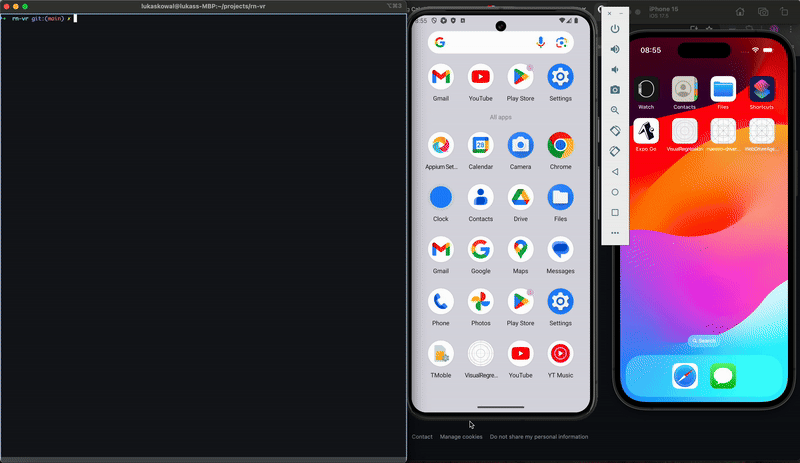

## react-native-visual-regression




This package orchestrates several tools to provide a flexible visual regression solution for React Native (RN).

If you are using Storybook in your project, you can perform visual regression testing against existing stories.

### Storybook

You need to have an app build that can launch in Storybook mode. See the `example` directory for reference.

Storybook allows you to render any screen or component in your application. By capturing screenshots of these screens or components in a controlled environment, you can ensure consistent results.

Rendering only the screens or components that you are interested in regression testing will be more efficient, as you won't need to navigate through multiple screens to reach a particular screen.

### Installation

```bash
npm install --save-dev @powala/react-native-visual-regression
```

Add to your `.gitignore`

```
visual-regression/current
visual-regression/diff
VisualRegressionTestReport.*
```

### Usage

Add the configuration file `rn-vr.config.js` to the root of your project:

```javascript
module.exports = {
  devices: [ // You can run visual regression for multiple devices
    {
      platform: 'android',
      name: 'Pixel_8_API_34',
    },
  ],
  appId: 'com.anonymous.VisualRegression', // appId of the app
  android: {
    activity: ".MainActivity",
  },
  storiesDirectories: [ // Directories where the stories are located
    './example/.storybook'
  ]
};
```

Mark which story should have visual regression coverage:

```javascript
export const AnotherExample: StoryObj<typeof MyButton> = {
  args: {
    text: 'Another example',
  },
  parameters: {
    visualRegression: true,
  }
};
```

##### Run Visual Regression:

```bash
npx rn-vr
```

A visual regression run will generate a set of assets in the visual-regression directory at the root of the project.

* baseline: The current source of truth for visual regression. If a given story does not have a baseline set, the initial run will create the baseline screenshot. This should be committed to version control as a reference.

* current: Screenshots produced by the latest visual regression run. If approved, these will become the baseline and the new source of truth. This should be omitted from version history.

* diff: A comparison between the current and baseline screenshots. This should be omitted from version history.

Additionally, the run will produce:

* VisualRegressionTestReport.md: A report summarizing the run.

##### Approve changes 

```bash
npx rn-vr -a
```


### Command Arguments

| Argument               | Default   | Example                                                            | Notes                                                |
| --------------         | --------- | --------------------------                                         | ---------------------------------------------------- |
| --approve \| -a        | undefined | -a                                                                 | Approve base images with the current version         |
| --file \| -f           | undefined | -f .storybook/stories/Button/Button.stories.tsx                    | Filename to run visual regression on                 |
| --story \| -s          | undefined | -s MyButton-AnotherExample | Target a particular Story kind-name   |                                                      |
| --device \| -d         | undefined | -d "Pixel 8" -d "iPhone 15" | Run only on specified devices        |                                                      |
| --reportFormat \| -rf  | md        | --reportFormat "html" | Format of the generated report             |                                                      |
| --migrateToV2          | undefined | --migrateToV2 | Migrate baseline directory to V2 structure         |                                                      |

### Prerequisites

- Ensure the app you want to run against is installed on the simulator/emulator you want to use.
- For best results run the app in Release mode, otherwsie bundler will slow down the run and might produce inconsistencies.
- The app can launch in Storybook mode, preferably without a UI, so you can capture only the screen. See the `example` directory for more details.
- Story files should end with `*.stories.tsx`.


### Migration from v1 to v2

Run following to migrate `baseline` directory to new folder structure which is now split by devices.

```
npx rn-vr --migrateToV2
```

Add android app activity to to the `rn-vr.config.js` config

```
...
android: {
  activity: ".MainActivity",
},
...
```